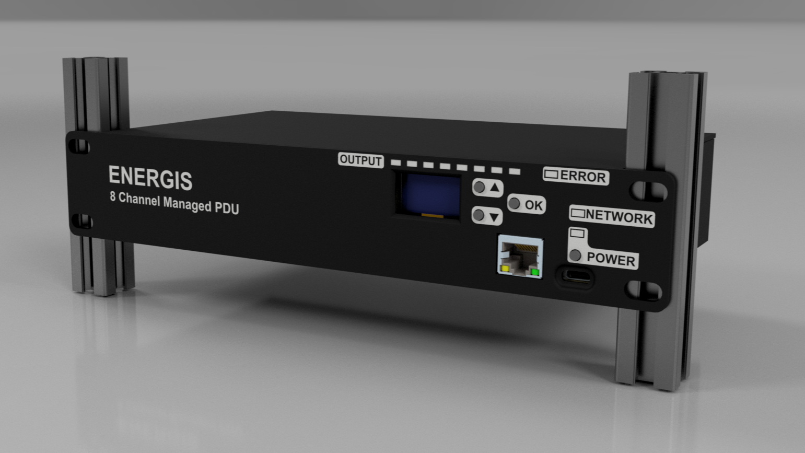
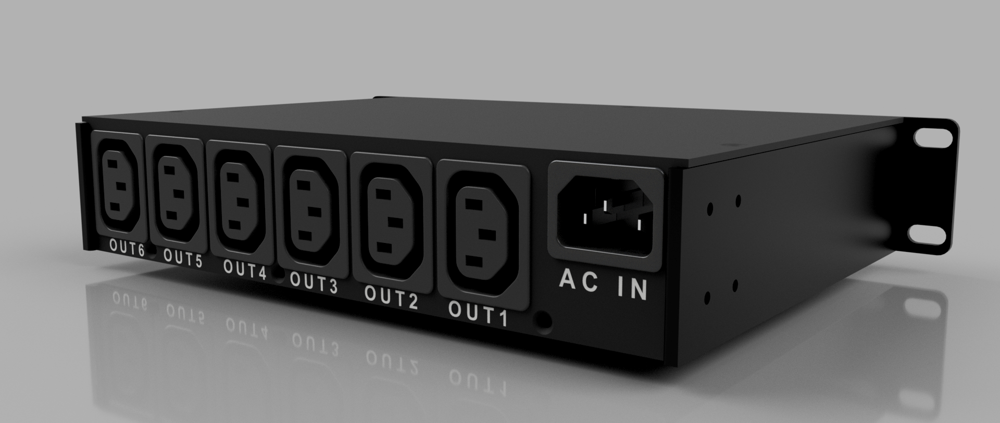

# ENERGIS - The Managed PDU Project for 10-Inch Rack

## Overview
The **10-Inch Rack PDU (Power Distribution Unit)** is a modular power management system designed for efficient control and monitoring of power in a rack-mounted environment. The project includes a controller board, a display board, and a relay board to handle switching and power management.

## Development Phases

| Phase                        | Status |
|------------------------------|--------|
| **PCB Design & Prototyping**   |  |
| **Enclosure Design**   |  |
| **Order PCB**   |  |
| **Prototyping and Hardware Testing** |  |
| **Initial Firmware Development** |  |
| **Enclosure Testing & Ventilation** |  |
| **Web-Based UI for Control**   |  |
| **Power Logging & Alerts**     |  |
| **Production Optimization**    |  |

## Features
- **Controller Board:** Handles Ethernet communication, power conversion, and system logic.
- **Display Board:** Provides user interaction with OLED display and status LEDs.
- **Relay Board:** Manages AC switching with 8x 230V relays, fuses, and safety isolation.
- **Ethernet Connectivity:** Uses the W5500 SPI-based Ethernet chip for remote control and monitoring.
- **Power Measurement:** AC voltage and current sensing for real-time monitoring.
- **3D Printed Enclosure:** Designed for 10-inch rack mounting with front and rear access.

## Specifications

### Electrical Characteristics
- **Input Voltage:** 230V AC, 10A max
- **Internal Power Supply:** 12V, 1.5A SMPS
- **Derived Voltages:** 5V and 3.3V regulated from 12V
- **Relay Supply:** 12V dedicated for relay operation

### Relay Output Ratings
- **Common AC Trace Handling:** 16A max
- **Per-Relay Trace Rating:** 15A max
- **Relay Contact Rating:** 16A max

### Control & Driving Circuit
- **Relay Driver:** ULN2803 Darlington Array
- **Driving Current:** 33mA per relay
- **Current Limit Resistor:** Configured for 35mA max per relay coil

## Hardware Stackup
### **PCB Layer Configuration:**
- **Relay Board:** 2-layer PCB.
- **Display Board:** 2-layer PCB.
- **Controller Board:** 4-layer PCB (JLC04161H-3313, 1.56mm ±10% thickness)

### **Impedance Control:**
| Impedance (Ω)  | Type                             | Signal  | Bottom  | Trace Width (mm) | Trace Spacing (mm) |
|-------------- | -------------------------------- | ------- | ------- | ---------------- | ------------------ |
| 90             | Differential Pair (Non coplanar) | L1      | L2      | 0.1549           | 0.1905             |
| 100            | Differential Pair (Non coplanar) | L1      | L2      | 0.1209           | 0.1905             |

### **Layer Stackup:**
| Layer    | Material                   | Thickness (mm) |
|-------- | -------------------------- | -------------- |
| L1 (SIG) | Outer Copper Weight 1oz    | 0.0350 |
| Prepreg  | 3313 RC57% 4.2mil          | 0.0994 |
| L2 (GND) | Inner Copper Weight        | 0.0152 |
| Core     | 1.3mm H/HOZ with copper    | 1.2650 |
| L3 (GND) | Inner Copper Weight        | 0.0152 |
| Prepreg  | 3313 RC57% 4.2mil          | 0.0994 |
| L4 (SIG) | Outer Copper Weight 1oz    | 0.0350 |

## Schematics
The full schematics for each board are available:
- **[Controller Board Schematics](src/PDF/Controller-Board_Schematics.pdf)**
- **[Display Board Schematics](src/PDF/Display-Board_Schematics.pdf)**
- **[Relay Board Schematics](src/PDF/Relay-Board_Schematics.pdf)**

## Usage
1. **Setup the hardware** by assembling the three boards.
2. **Power on the system** and configure settings via the display or Ethernet interface.
3. **Monitor and control** relay switching and power parameters.

## Future Plans

### Planned Improvements
- **Ventilation Testing & Optimization:** Evaluate enclosure thermals and, if needed, add passive or active cooling.
- **Firmware Development:** Implement remote control and monitoring via Ethernet.
- **Web-Based UI:** A browser-accessible interface for managing power outputs.
- **Metal Enclosure:** If production scales up, explore CNC or sheet-metal enclosures.

## License
This project is licensed under the **GPL-3.0 License**. See the [LICENSE](LICENSE) file for details.

## Contact
For questions or feedback:
- **Email:** [s.dvid@hotmail.com](mailto:s.dvid@hotmail.com)
- **GitHub:** [DvidMakesThings](https://github.com/DvidMakesThings)
