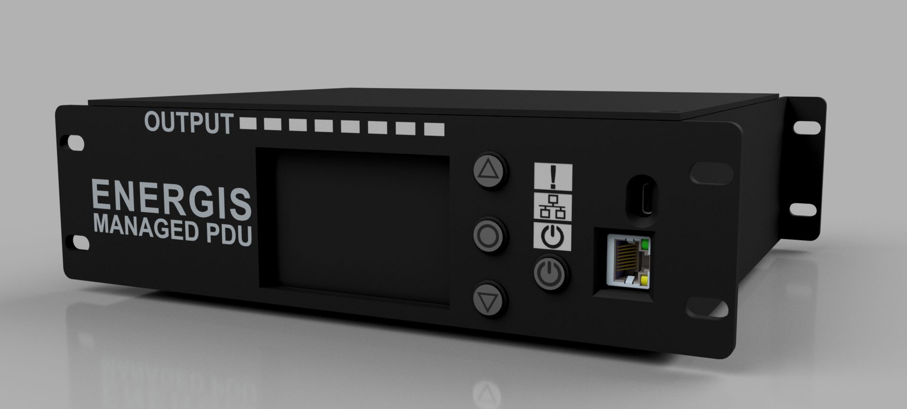
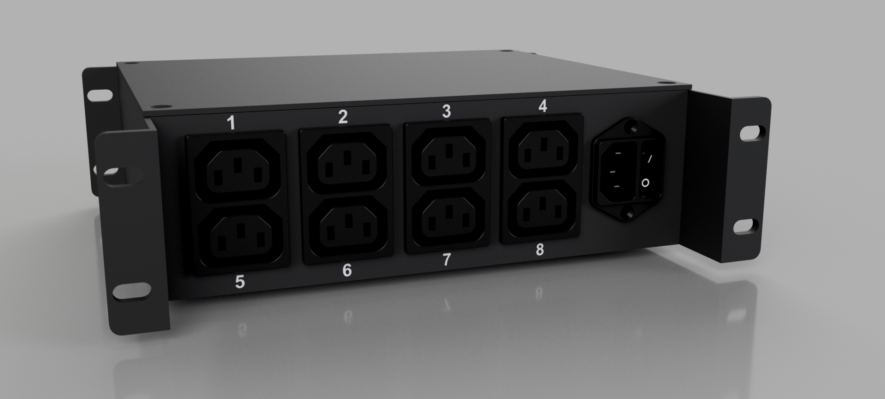

# ENERGIS - The Managed PDU Project for 10-Inch Rack

## Overview

The **10-Inch Rack PDU (Power Distribution Unit)** is a modular power
management system designed for efficient control and monitoring of power in a
rack-mounted environment. The project includes a controller board, a display
board, and a relay board to handle switching and power management.

Update 05.2025: Since lot of people said, it would be nice to have a Non-230V-Version, I started to develop
the USB-C version of ENERGIS with USB PD Source functionality: [PDNode-600 Pro](https://github.com/DvidMakesThings/HW_PDNode-600-Pro)

## Hardware Development Phases
| Phase                                | Status   |
| ------------------------------------ | -------- |
| **PCB Design for Rev1.0**            |  |
| **Enclosure Design**                 |  |
| **Order PCB**                        |  |
| **Prototyping and Hardware Testing** |  |
| **Implementing Rev2.0**              |  |
| **Implementing Relay Board Rev2.1**  |  |
| **Initial Firmware Development**     |  |
| **Final PCB Revision**               |  |
| **Enclosure Testing & Ventilation**  |  |
| **Power Monitoring**                 |  |
| **Production Optimization**          |  |

### Changelog:
#### Rev1.0:
- Initial desing

#### Rev2.0:
- Correct all hardware related bugs
- Display-Board Rev2.0: 
    - Buttons too close to each-other. Manual control is uncomfortable 
    - MCP23S17 seems like unreachable, invertory shortage everywhere. Change to MCP23017
- Controller-Board Rev2.0: 
    - W5500 crystal wiring bug. 
    - v1.0 connectors replaced to smaller FFC ones
- Relay-Board Rev2.0: 
    - Add HLW8032 for power monitoring
    - Replace Flyback converter to a cheaper - ready made AC-DC converter unit

#### Rev2.1:
- Relay-Board Rev2.1: 
    - Capacitive dropper does not have enough power to supply 8xHLW8032 - Non-Isolated  buck converter implemented
- Display-Board Rev2.1:
    - Planned revision without the LCD. This is the main size issue, going to do a version where the setup fits in 1U size. 
    Currently for debug purposes 1.5U is perfectly fine

#### ENERGIS 1.0.0 Final revision
- Relay-Board and Controller board is now combined
- Added FT232 to separate CDC/UART
- Added 2:1 USB MUX
- Added enable functionality to the PSU
- Added high precision LDO to supply the MCU

## Firmware Development Phases
| Phase                                | Status   |
| ------------------------------------ | -------- |
| **CONFIG file for HW description**   |  |
| **ILI4988 TFT LCD Driver**           |  |
| **MCP23017 Display-Board Driver**    |  |
| **MCP23017 Relay-Board Driver**      |  |
| **W5500 Ethernet Driver**            |  |
| **CAT24C512 512K EEPROM Driver**     |  |
| **Version Control and EEPROM Data**  |  |
| **Display Functions**                |  |
| **System Startup Script**            |  |
| **Multicore processing and RTOS**    |  |
| **Pushbutton control**               |  |
| **HLW8032 Power Monitor Dirver**     |  |
| **Make Everything work together**    |  |
| **HTML Server Implementation**       |  |
| **Software debugging**               |  |
| **Ethernet based firmware update**   |  |

## Features

- **Controller Board:** Handles Ethernet communication, power conversion, and
  system logic.
- **Display Board:** Provides user interaction with OLED display and status LEDs.
- **Relay Board:** Manages AC switching with 8x 230V relays, fuses, and safety
  isolation.
- **Ethernet Connectivity:** Uses the W5500 SPI-based Ethernet chip for remote
  control and monitoring.
- **Power Measurement:** AC voltage and current sensing for real-time
  monitoring.
- **3D Printed Enclosure:** Designed for 10-inch rack mounting with front and
  rear access.

## Specifications

### Electrical Characteristics

- **Input:** 230V AC, 15A max
- **Output:**   230V AC, 15A/Active Channels - Amps per Channel
- **Internal Power Supply:** 12V, 1.5A SMPS
- **Derived Voltages:** 5V and 3.3V regulated from 12V
- **Relay Supply:** 12V dedicated for relay operation

### Relay Output Ratings

- **Common AC Trace Handling:** 15A max
- **Per-Relay Trace Rating:** 16A max
- **Relay Contact Rating:** 16A max

### Control & Driving Circuit

- **Relay Driver:** ULN2803 Darlington Array
- **Driving Current:** 33mA per relay
- **Current Limit Resistor:** Configured for 35mA max per relay coil

## Hardware Stackup

### **PCB Layer Configuration:**

- **Relay Board:** 2-layer PCB.
- **Display Board:** 2-layer PCB.
- **Controller Board:** 4-layer PCB (JLC04161H-3313, 1.56mm ±10% thickness)

### **Impedance Control:**

| Impedance (Ω)  | Type                             | Signal  | Bottom  | Trace Width (mm) | Trace Spacing (mm) |
| -------------- | -------------------------------- | ------- | ------- | ---------------- | ------------------ |
| 90             | Differential Pair (Non-coplanar) | L1      | L2      | 0.1549           | 0.1905             |
| 100            | Differential Pair (Non-coplanar) | L1      | L2      | 0.1209           | 0.1905             |

### **Layer Stackup:**

| Layer    | Material                   | Thickness (mm) |
| -------- | -------------------------- | -------------- |
| L1 (SIG) | Outer Copper Weight 1oz    | 0.0350 |
| Prepreg  | 3313 RC57% 4.2mil          | 0.0994 |
| L2 (GND) | Inner Copper Weight        | 0.0152 |
| Core     | 1.3mm H/HOZ with copper    | 1.2650 |
| L3 (GND) | Inner Copper Weight        | 0.0152 |
| Prepreg  | 3313 RC57% 4.2mil          | 0.0994 |
| L4 (SIG) | Outer Copper Weight 1oz    | 0.0350 |

## Schematics

The full schematics for each board are available:

- **[Controller Board Schematics](src/PDF/_proto/Controller-Board/Rev%202.0/Controller-Board_2.0_Schematics.pdf)**
- **[Display Board Schematics](src/PDF/_proto/Display-Board/Rev%202.0/Display-Board_2.0_Schematics.pdf)**
- **[Relay Board Schematics](src/PDF/_proto/Relay-Board/Rev2.1/Relay-Board_2.1_Schematics.pdf)**

## Usage

1. **Setup the hardware** by assembling the three boards.
2. **Power on the system** and configure settings via the display or Ethernet
   interface.
3. **Monitor and control** relay switching and power parameters.

## Future Plans

### Planned Improvements

- **Ventilation Testing & Optimization:** Evaluate enclosure thermals and, if
  needed, add passive or active cooling.
- **Firmware Development:** Implement remote control and monitoring via
  Ethernet.
- **Web-Based UI:** A browser-accessible interface for managing power outputs.
- **Metal Enclosure:** If production scales up, explore CNC or sheet-metal
  enclosures.

## License

This project is licensed under the **GPL-3.0 License**. See the [LICENSE](LICENSE)
file for details.

## Contact

For questions or feedback:
- **Email:** [s.dvid@hotmail.com](mailto:s.dvid@hotmail.com)
- **GitHub:** [DvidMakesThings](https://github.com/DvidMakesThings)
