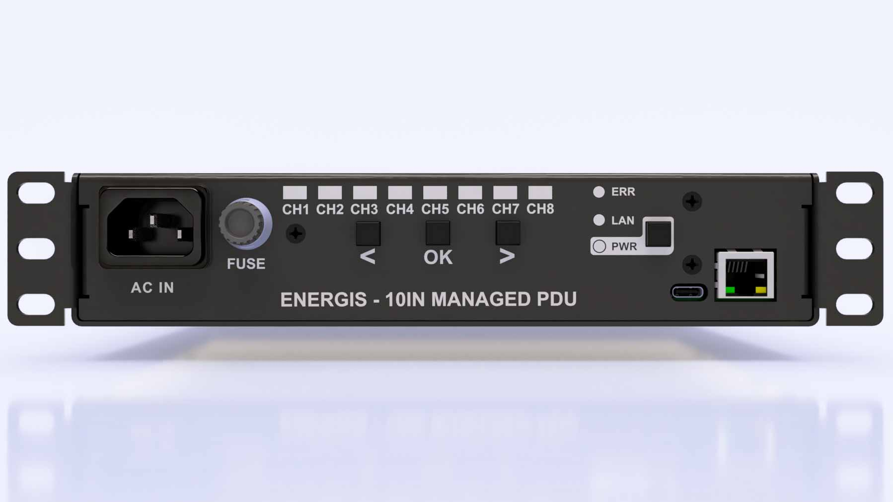
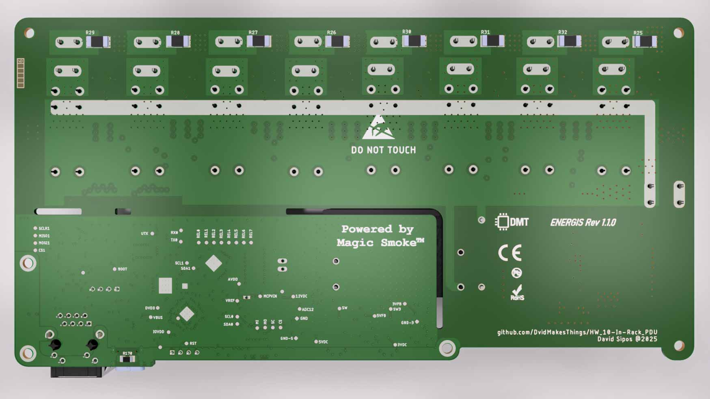
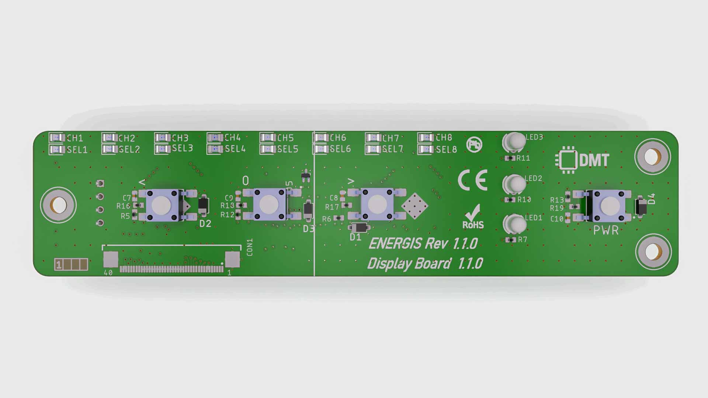
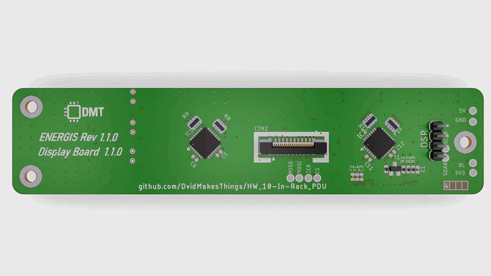
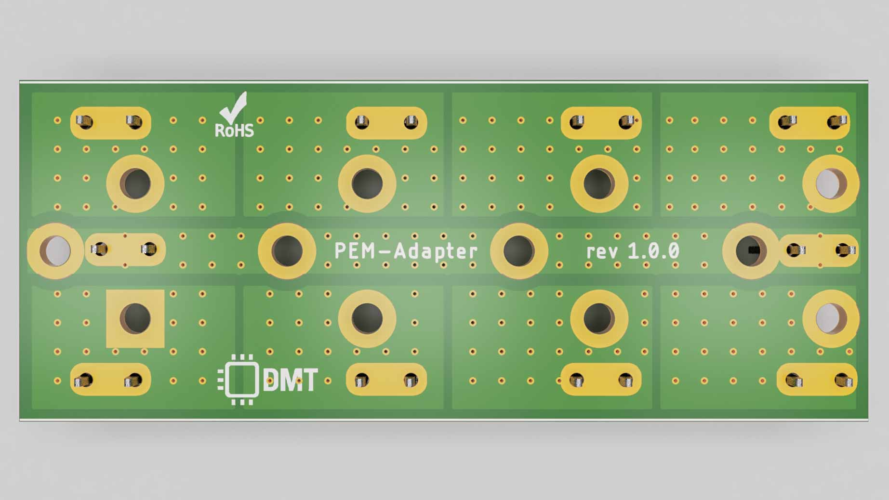
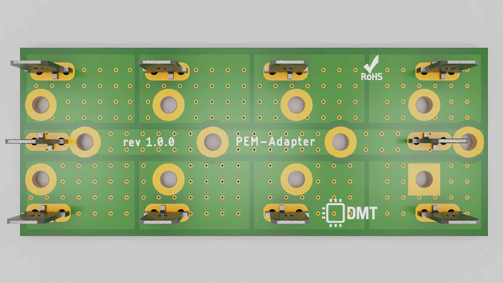
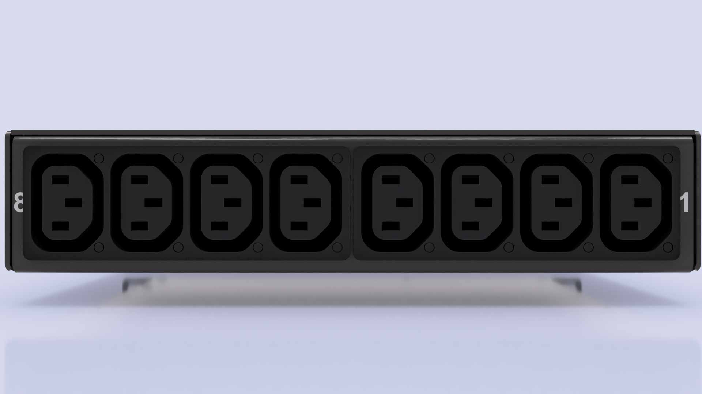
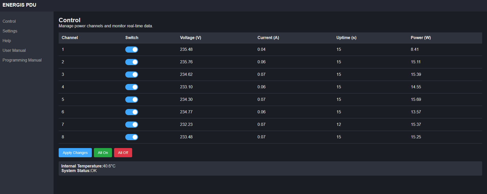
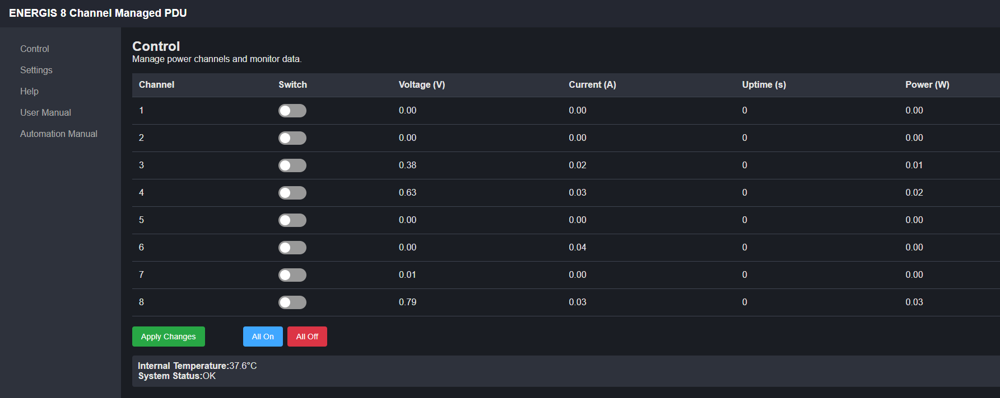
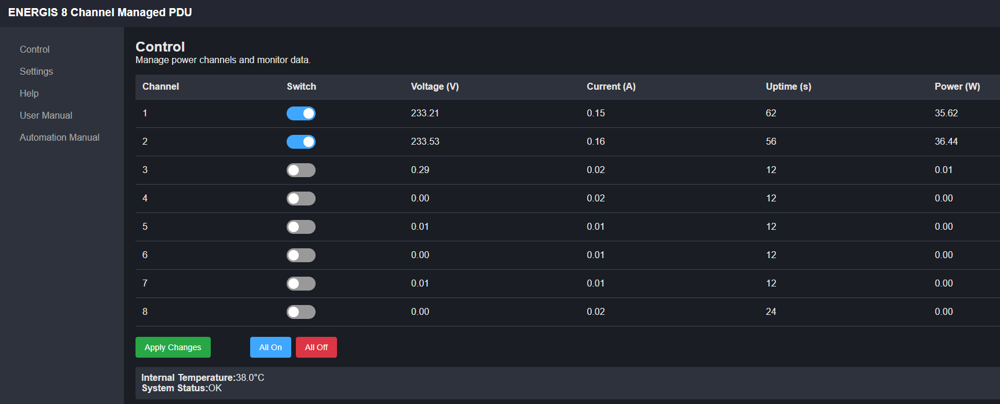

# ENERGIS - The Managed PDU Project for 10-Inch Rack

## Overview

The **10-Inch Rack PDU (Power Distribution Unit)** is a modular power management system designed for efficient control and monitoring of power in a
rack-mounted environment. The project includes a Main Board and a display board to handle switching and power management.

Update 05.2025: Since lot of people said, it would be nice to have a Non-230V-Version, I started to develop
the USB-C version of ENERGIS with USB PD Source functionality: [PDNode-600 Pro](https://github.com/DvidMakesThings/HW_PDNode-600-Pro)

## Progress and news

## Hardware Development Phases
| Phase                                | Status   |
| ------------------------------------ | -------- |
| **PCB Design for Rev1.0**            |  |
| **Enclosure Design**                 |  |
| **Order PCB**                        |  |
| **Prototyping and Hardware Testing** |  |
| **Implementing Rev2.0**              |  |
| **Implementing Relay Board Rev2.1**  |  |
| **Initial Firmware Development**     |  |
| **Final PCB Revision**               |  |
| **Enclosure Testing & Ventilation**  |  |
| **Power Monitoring**                 |  |
| **Production Optimization**          |  |

## Firmware Development Phases
| Phase                                | Status   |
| ------------------------------------ | -------- |
| **CONFIG file for HW description**   |  |
| **ILI4988 TFT LCD Driver**           |  |
| **MCP23017 Display-Board Driver**    |  |
| **MCP23017 Relay-Board Driver**      |  |
| **W5500 Ethernet Driver**            |  |
| **CAT24C512 512K EEPROM Driver**     |  |
| **Version Control and EEPROM Data**  |  |
| **Display Functions**                |  |
| **System Startup Script**            |  |
| **Multicore processing and RTOS**    |  |
| **Pushbutton control**               |  |
| **HLW8032 Power Monitor Dirver**     |  |
| **Make Everything work together**    |  |
| **HTML Server Implementation**       |  |
| **Software debugging**               |  |
| **Ethernet based firmware update**   |  |

Development doesn’t stop here. Planned improvements include:
- **Production optimization** → finalize assembly workflow and cost reduction.  
- **Extended testing** → expand automated test coverage (I²C, SPI, long-term soak tests).  
- **Community feedback** → incorporate suggestions and adapt design for wider use cases.  
- **And even more more more debugging** → It survived the 24h test, but you can never test enough
- **Enclosure manufacturing** → evaluate and contact sheet-metal manufacturers for a professional case. 3D printed PLA case is nice, but it's not very professional

Planned features (the list will be appended as I find more development possibilities):
- **Renamebable Channels** Currently channels are marked as 1, 2 ... 8. I'm planning to add some label functionality
- **Offset Calibration** Channels have 0.75V-0.77V and 0.02-0.05A offset. Some off-state offset auto-zero function will be implemented

---

## Specifications (EU, IEC/ENEC)

### Electrical Characteristics

* **Input:** 230 V AC, **10 A max**
* **Output Voltage:** 230 V AC
* **Total Output Current (all channels combined):** **10 A max**
* **Per-Channel Output Current:** **10 A max per active channel**, with **total combined output limited to 10 A**
* **Internal Power Supply:** 12 V, 1.5 A SMPS
* **Derived Internal Voltages:** 5 V and 3.3 V regulated from 12 V

### Relay Output Ratings

* **Common AC Trace Handling:** 16 A max
* **Per-Relay Trace Rating:** 16 A max
* **Relay Contact Rating:** 16 A max

### Control and Driving Circuit

* **Relay Driver:** ULN2803 Darlington Array
* **Driving Current:** 33 mA per relay

## Specifications (US/Canada, UL/CSA)

### Electrical Characteristics

* **Input:** 250 V AC, **15 A max**
* **Output Voltage:** 250 V AC
* **Total Output Current (all channels combined):** **15 A max**
* **Per-Channel Output Current:** **15 A max per active channel**, with **total combined output limited to 15 A**
* **Internal Power Supply:** 12 V, 1.5 A SMPS
* **Derived Internal Voltages:** 5 V and 3.3 V regulated from 12 V

### Relay Output Ratings

* **Common AC Trace Handling:** 16 A max
* **Per-Relay Trace Rating:** 16 A max
* **Relay Contact Rating:** 16 A max

### Control and Driving Circuit

* **Relay Driver:** ULN2803 Darlington Array
* **Driving Current:** 33 mA per relay

---

## Features

- **Main Board:** Handles Ethernet communication, power conversion, and system logic. Manages AC switching with 8x 230V relays and safety
  isolation.
- **Display Board:** Headless mode, possible manual control with push buttons and real-time LED feedback
- **Ethernet Connectivity:** Uses the W5500 SPI-based Ethernet chip for remote
  control and monitoring via SNMPv1 and/or Web-UI
- **Power Measurement:** AC voltage and current sensing for monitoring.
- **Sheetmetal Enclosure:** Designed for 10-inch rack mounting with front and rear access.

--- 

## Schematics

The full schematics for each board are available:

- **[Main Board Schematics](src/PDF/ENERGIS-1.1.0_mainBoard_schematics.pdf)**
- **[Display Board Schematics](src/PDF/ENERGIS-1.1.0_displayBoard_schematics.pdf)**

---

## Hardware Stackup

<table>
  <tr>
    <td align="center">
      
       <b>Main Board Top</b>
    </td>
    <td align="center">
      
       <b>Main Board Bottom</b>
    </td>
  </tr>
  <tr>
    <td align="center">
      
       <b>Display Board Top</b>
    </td>
    <td align="center">
      
       <b>Display Board Bottom</b>
    </td>
  </tr>
  <tr>
    <td align="center">
      
       <b>PEM Adapter</b>
    </td>
    <td align="center">
      
       <b>PEM Adapter</b>
    </td>
  </tr>
</table>

## Enclosure

The **Energis** PDU enclosure is built from **Aluminum 5052 sheet metal** with a thickness of **1.5 mm**, ensuring both durability and lightweight construction. It follows a **10-inch rack form factor (1U height)** with custom mounting brackets and integrated cutouts for AC input, Ethernet, USB-C, status LEDs, and IEC outlets.

Key specifications:
* **Material:** Aluminum 5052, 1.5 mm
* **Finish:** Powder coat (matte black, process black)
* **Threads & tapped holes:** Yes (no inserts, no welding)
* **Marking:** Laser engraved front and back panel labeling
* **Design:** Precision CNC cut and bent sheet metal, matte black powder-coated for protection and aesthetics

  

  
  

  
Mounting options:
* **Desktop use** without brackets  
* **10-inch rack mounting** 

---

## Web UI

The ENERGIS now includes a lightweight embedded Web-UI for configuration and control.

### All Channels On

  

    <h4 style="margin-bottom: 8px;">All Channels Off</h4>
    
  

  

    <h4 style="margin-bottom: 8px;">CH1-CH2 ~40W Load</h4>
    
  

---

## Tests

Automated hardware and firmware validation is now integrated into **ENERGIS**.  
Test reports are published through **GitHub Pages** for transparent, reproducible verification.

All tests are executed using my **Universal Test Framework (UTFW)**, a custom Python-based automation framework, developed for hardware and firmware validation.  
UTFW provides deterministic test sequencing, automated setup and teardown, structured logging, analysis, and unified HTML/XML reporting.  
The nightly regression runs every individual test together to verify overall system stability and catch integration issues early.

---

### Nightly Regression Suite
Comprehensive end-to-end system test covering:
- UART communication  
- SNMP protocol  
- Web interface (PCAP)  
- EEPROM persistence  
- Power monitoring (HLW8032)  
- ADC/thermal sanity checks  
- Relay stress switching  

**[Latest Regression Report](https://dvidmakesthings.github.io/HW_10-In-Rack_PDU/Tests/Nightly_regression/test_suite_Nightly_Tests_20251005_232014.html)**

---

### Individual Test Reports
- [Serial Communication Test Report (HTML)](https://dvidmakesthings.github.io/HW_10-In-Rack_PDU/Tests/report_tc_serial_utfw/tc_serial_utfw_report.html)
- [Network SNMP Test Report (HTML)](https://dvidmakesthings.github.io/HW_10-In-Rack_PDU/Tests/report_tc_network_snmp/tc_network_snmp_report.html)
- [Network PCAP Analysis Report (HTML)](https://dvidmakesthings.github.io/HW_10-In-Rack_PDU/Tests/report_tc_network_pcap/tc_network_pcap_report.html)
- [PCAP Capture Test Report (HTML)](https://dvidmakesthings.github.io/HW_10-In-Rack_PDU/Tests/report_tc_pcap_capture/tc_pcap_capture_report.html)
- [Power Monitoring Test Report (HLW8032) (HTML)](https://dvidmakesthings.github.io/HW_10-In-Rack_PDU/Tests/report_tc_power_hlw8032/tc_power_hlw8032_report.html)
- [EEPROM Persistence Test Report (HTML)](https://dvidmakesthings.github.io/HW_10-In-Rack_PDU/Tests/report_tc_eeprom_persistence/tc_eeprom_persistence_report.html)
- [Sanity Check Test Report (HTML)](https://dvidmakesthings.github.io/HW_10-In-Rack_PDU/Tests/report_tc_sanity_check/tc_sanity_check_report.html)
- [Relay Stress Switching Test Report (HTML)](https://dvidmakesthings.github.io/HW_10-In-Rack_PDU/Tests/report_tc_stress_switching/tc_stress_switching_report.html)

---

### Changelog:
#### Rev0.1.0:
- Initial desing

#### Rev0.2.0:
- Correct all hardware related bugs
- Display-Board Rev0.2.0: 
    - Buttons too close to each-other. Manual control is uncomfortable 
    - MCP23S17 seems like unreachable, invertory shortage everywhere. Change to MCP23017
- Controller-Board Rev0.2.0: 
    - W5500 crystal wiring bug. 
    - v1.0 connectors replaced to smaller FFC ones
- Relay-Board Rev0.2.0: 
    - Add HLW8032 for power monitoring
    - Replace Flyback converter to a cheaper - ready made AC-DC converter unit

#### Rev0.2.1:
- Relay-Board Rev0.2.1: 
    - Capacitive dropper does not have enough power to supply 8xHLW8032 - Non-Isolated  buck converter implemented
- Display-Board Rev0.2.1:
    - Planned revision without the LCD. This is the main size issue, going to do a version where the setup fits in 1U size. 
    Currently for debug purposes 1.5U is perfectly fine

#### ENERGIS 1.0.0 
- Relay-Board and Controller Board is now combined: Main Board
- Added enable functionality to the PSU
- Added high precision LDO to supply the MCU
- Additional fan is possible, but the temperature doesn't go above 36°C

#### ENERGIS 1.1.0
- Cleaned up routing both for Display- and Main board
- NEW: PEM-Adapter: Unfortunately the commercially available Power Entry Modules are using bussed topology, seems like it's
impossible to buy snap-in modules with individual L/N control. The only possibility I've found is the 3-104-370 from Schurter, but
it's a PCB-mountable version. Using a small adapter board to hook the solder joints to faston connectors seems to be the only possibility

## License
### Software Components
This project's software is licensed under the **GNU Affero General Public License v3.0 (AGPL-3.0)**.
See the [Software License](LICENSE-AGPL) file for details.

#### What AGPL-3.0 means:

- ✅ **You can** freely use, modify, and distribute this software
- ✅ **You can** use this project for personal, educational, or internal purposes
- ✅ **You can** contribute improvements back to this project

- ⚠️ **You must** share any modifications you make if you distribute the software
- ⚠️ **You must** release the source code if you run a modified version on a server that others interact with
- ⚠️ **You must** keep all copyright notices intact

- ❌ **You cannot** incorporate this code into proprietary software without sharing your source code
- ❌ **You cannot** use this project in a commercial product without either complying with AGPL or obtaining a different license

### Hardware Components
Hardware designs, schematics, and related documentation are licensed under the **Creative Commons Attribution-NonCommercial-ShareAlike 4.0 International License (CC BY-NC-SA 4.0)**. See the [Hardware License](LICENSE-CC-BY-NC-SA) file for details.

#### What CC BY-NC-SA 4.0 means:

- ✅ **You can** study, modify, and distribute the hardware designs
- ✅ **You can** create derivative works for personal, educational, or non-commercial use
- ✅ **You can** build this project for your own personal use

- ⚠️ **You must** give appropriate credit and indicate if changes were made
- ⚠️ **You must** share any modifications under the same license terms
- ⚠️ **You must** include the original license and copyright notices

- ❌ **You cannot** use the designs for commercial purposes without explicit permission
- ❌ **You cannot** manufacture and sell products based on these designs without a commercial license
- ❌ **You cannot** create closed-source derivatives for commercial purposes
- ❌ **You cannot** use the designer's trademarks without permission

### Commercial & Enterprise Use

Commercial use of this project is prohibited without obtaining a separate commercial license. If you are interested in:

- Manufacturing and selling products based on these designs
- Incorporating these designs into commercial products
- Any other commercial applications

Please contact me through any of the channels listed in the [Contact](#contact) section to discuss commercial licensing arrangements. Commercial licenses are available with reasonable terms to support ongoing development.

## Contact

For questions or feedback:
- **Email:** [dvidmakesthings@gmail.com](mailto:dvidmakesthings@gmail.com)
- **GitHub:** [DvidMakesThings](https://github.com/DvidMakesThings)

## Contributing

Contributions are welcome! As this is an early-stage project, please reach out before 
making substantial changes:

1. Fork the repository
2. Create a feature branch (`git checkout -b feature/concept`)
3. Commit your changes (`git commit -m 'Add concept'`)
4. Push to the branch (`git push origin feature/concept`)
5. Open a Pull Request with a detailed description