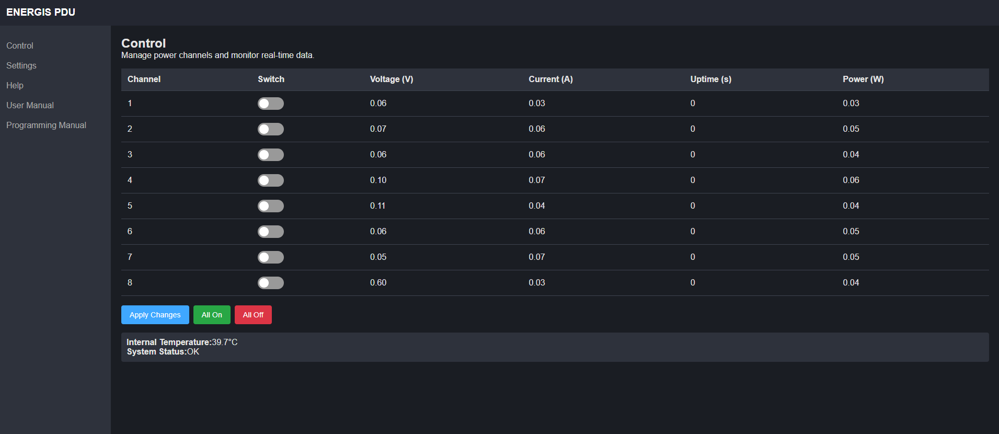
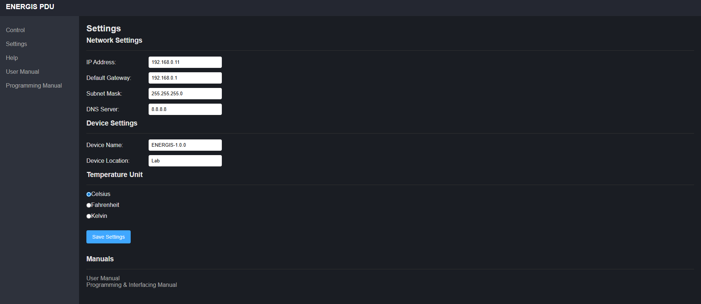

# ENERGIS - The Managed PDU Project for 10-Inch Rack

## Overview

The **10-Inch Rack PDU (Power Distribution Unit)** is a modular power
management system designed for efficient control and monitoring of power in a
rack-mounted environment. The project includes a Main Board and a display
board to handle switching and power management.

Update 05.2025: Since lot of people said, it would be nice to have a Non-230V-Version, I started to develop
the USB-C version of ENERGIS with USB PD Source functionality: [PDNode-600 Pro](https://github.com/DvidMakesThings/HW_PDNode-600-Pro)

## Tests

Automated hardware and firmware tests are now part of ENERGIS.  
Reports are available on GitHub Pages:

- [Serial Communication Test Report (HTML)](https://dvidmakesthings.github.io/HW_10-In-Rack_PDU/Tests/report_tc_serial_utfw/tc_serial_utfw_report.html)
- [Network SNMP Test Report (HTML)](https://dvidmakesthings.github.io/HW_10-In-Rack_PDU/Tests/report_tc_network_snmp/tc_network_snmp_report.html)

---

## Web UI

The ENERGIS now includes a lightweight embedded Web-UI for configuration and control.

### All Channels On

### All Channels Off

### Settings Page

## What Comes Next

Development doesn’t stop here. Planned improvements include:
- **Production optimization** → finalize assembly workflow and cost reduction.  
- **Extended testing** → expand automated test coverage (I²C, SPI, long-term soak tests).  
- **Community feedback** → incorporate suggestions and adapt design for wider use cases.  
- **And even more more more debugging** → It survived the 24h test, but you can never test enough
- **Enclosure manufacturing** → evaluate and contact sheet-metal manufacturers for a professional case. 3D printed PLA case is nice, but it's not very professional

## Hardware Development Phases
| Phase                                | Status   |
| ------------------------------------ | -------- |
| **PCB Design for Rev1.0**            |  |
| **Enclosure Design**                 |  |
| **Order PCB**                        |  |
| **Prototyping and Hardware Testing** |  |
| **Implementing Rev2.0**              |  |
| **Implementing Relay Board Rev2.1**  |  |
| **Initial Firmware Development**     |  |
| **Final PCB Revision**               |  |
| **Enclosure Testing & Ventilation**  |  |
| **Power Monitoring**                 |  |
| **Production Optimization**          |  |

### Changelog:
#### Rev0.1.0:
- Initial desing

#### Rev0.2.0:
- Correct all hardware related bugs
- Display-Board Rev0.2.0: 
    - Buttons too close to each-other. Manual control is uncomfortable 
    - MCP23S17 seems like unreachable, invertory shortage everywhere. Change to MCP23017
- Controller-Board Rev0.2.0: 
    - W5500 crystal wiring bug. 
    - v1.0 connectors replaced to smaller FFC ones
- Relay-Board Rev0.2.0: 
    - Add HLW8032 for power monitoring
    - Replace Flyback converter to a cheaper - ready made AC-DC converter unit

#### Rev0.2.1:
- Relay-Board Rev0.2.1: 
    - Capacitive dropper does not have enough power to supply 8xHLW8032 - Non-Isolated  buck converter implemented
- Display-Board Rev0.2.1:
    - Planned revision without the LCD. This is the main size issue, going to do a version where the setup fits in 1U size. 
    Currently for debug purposes 1.5U is perfectly fine

#### ENERGIS 1.0.0 Final revision
- Relay-Board and Controller Board is now combined: Main Board
- Added enable functionality to the PSU
- Added high precision LDO to supply the MCU
- Additional fan is possible, but the temperature doesn't go above 36°C

## Firmware Development Phases
| Phase                                | Status   |
| ------------------------------------ | -------- |
| **CONFIG file for HW description**   |  |
| **ILI4988 TFT LCD Driver**           |  |
| **MCP23017 Display-Board Driver**    |  |
| **MCP23017 Relay-Board Driver**      |  |
| **W5500 Ethernet Driver**            |  |
| **CAT24C512 512K EEPROM Driver**     |  |
| **Version Control and EEPROM Data**  |  |
| **Display Functions**                |  |
| **System Startup Script**            |  |
| **Multicore processing and RTOS**    |  |
| **Pushbutton control**               |  |
| **HLW8032 Power Monitor Dirver**     |  |
| **Make Everything work together**    |  |
| **HTML Server Implementation**       |  |
| **Software debugging**               |  |
| **Ethernet based firmware update**   |  |

## Features

- **Main Board:** Handles Ethernet communication, power conversion, and
  system logic. Manages AC switching with 8x 230V relays and safety
  isolation.
- **Display Board:** 
  - 1U version: Headless mode, possible manual control with push buttons and real-time LED feedback
  - 1.5U version: Provides user interaction with TFT display and push buttons.
- **Ethernet Connectivity:** Uses the W5500 SPI-based Ethernet chip for remote
  control and monitoring via SNMPv1 and/or Web-UI
- **Power Measurement:** AC voltage and current sensing for monitoring.
- **3D Printed Enclosure:** Designed for 10-inch rack mounting with front and rear access.

## Specifications

### Electrical Characteristics

- **Input:** 230V AC, 15A max
- **Output:**   230V AC, 15A/Active Channels - Amps per Channel
- **Internal Power Supply:** 12V, 1.5A SMPS
- **Derived Voltages:** 5V and 3.3V regulated from 12V
- **Relay Supply:** 12V dedicated for relay operation

### Relay Output Ratings

- **Common AC Trace Handling:** 15A max
- **Per-Relay Trace Rating:** 16A max
- **Relay Contact Rating:** 16A max

### Control & Driving Circuit

- **Relay Driver:** ULN2803 Darlington Array
- **Driving Current:** 33mA per relay
- **Current Limit Resistor:** Configured for 35mA max per relay coil

## Hardware Stackup

## JLC06161H-3313 (Finished Thickness: ~1.54 mm ±10 %) (6 layers – standard settings)
- **Total Layers:** 6  
- **Finished Thickness:** ~1.54 mm (±10 %)  
- **Outer Copper Weight:** 1 oz  
- **Inner Copper Weight:** 0.5 oz  
- **Prepreg & Core Materials:** FR4 (JLC06161H-3313)  

### Layer Stackup

| Layer    | Material                     | Thickness (mm) |
| -------- | ---------------------------- | -------------- |
| L1 (SIG) | Outer Copper Weight 1 oz     | 0.0350         |
| Prepreg  | 3313 RC57 % 4.2 mil           | 0.0994         |
| L2 (GND) | Inner Copper Weight 0.5 oz   | 0.0152         |
| Core     | 0.55 mm H (without copper)   | 0.5500         |
| L3 (PWR) | Inner Copper Weight 0.5 oz   | 0.0152         |
| Prepreg  | 2116 RC54 % 4.9 mil           | 0.1088         |
| L4 (SIG) | Inner Copper Weight 0.5 oz   | 0.0152         |

### Impedance Control

| Impedance (Ω) | Type                       | Signal | Top Ref | Bottom Ref | Trace Width (mm) | Trace Spacing (mm) |
| ------------- | -------------------------- | ------ | ------- | ---------- | ---------------- | ------------------ |
| 50            | Coplanar Single Ended      | L1     | /       | L2         | 0.2000           | /                  |
| 90            | Coplanar Differential Pair | L1     | /       | L2         | 0.1549           | 0.1905             |
| 100           | Coplanar Differential Pair | L1     | /       | L2         | 0.1209           | 0.1905             |
| 100           | Coplanar Differential Pair | L6     | L5      | /          | 0.1209           | 0.1905             |
| 90            | Coplanar Differential Pair | L6     | L5      | /          | 0.1549           | 0.1905             |
| 50            | Coplanar Single Ended      | L6     | L5      | /          | 0.2000           | /                  |

## Schematics

The full schematics for each board are available:

- **[Main Board Schematics](src/PDF/ENERGIS-1.0.0_mainBoard_schematics.pdf)**
- **[Display Board Schematics](src/PDF/ENERGIS-1.0.0_displayBoard_schematics.pdf)**

## License
### Software Components
This project's software is licensed under the **GNU Affero General Public License v3.0 (AGPL-3.0)**.
See the [Software License](LICENSE-AGPL) file for details.

#### What AGPL-3.0 means:

- ✅ **You can** freely use, modify, and distribute this software
- ✅ **You can** use this project for personal, educational, or internal purposes
- ✅ **You can** contribute improvements back to this project

- ⚠️ **You must** share any modifications you make if you distribute the software
- ⚠️ **You must** release the source code if you run a modified version on a server that others interact with
- ⚠️ **You must** keep all copyright notices intact

- ❌ **You cannot** incorporate this code into proprietary software without sharing your source code
- ❌ **You cannot** use this project in a commercial product without either complying with AGPL or obtaining a different license

### Hardware Components
Hardware designs, schematics, and related documentation are licensed under the **Creative Commons Attribution-NonCommercial-ShareAlike 4.0 International License (CC BY-NC-SA 4.0)**. See the [Software License](LICENSE-CC BY-NC-SA) file for details.

#### What CC BY-NC-SA 4.0 means:

- ✅ **You can** study, modify, and distribute the hardware designs
- ✅ **You can** create derivative works for personal, educational, or non-commercial use
- ✅ **You can** build this project for your own personal use

- ⚠️ **You must** give appropriate credit and indicate if changes were made
- ⚠️ **You must** share any modifications under the same license terms
- ⚠️ **You must** include the original license and copyright notices

- ❌ **You cannot** use the designs for commercial purposes without explicit permission
- ❌ **You cannot** manufacture and sell products based on these designs without a commercial license
- ❌ **You cannot** create closed-source derivatives for commercial purposes
- ❌ **You cannot** use the designer's trademarks without permission

### Commercial & Enterprise Use

Commercial use of this project is prohibited without obtaining a separate commercial license. If you are interested in:

- Manufacturing and selling products based on these designs
- Incorporating these designs into commercial products
- Any other commercial applications

Please contact me through any of the channels listed in the [Contact](#contact) section to discuss commercial licensing arrangements. Commercial licenses are available with reasonable terms to support ongoing development.

## Contact

For questions or feedback:
- **Email:** [dvidmakesthings@gmail.com](mailto:dvidmakesthings@gmail.com)
- **GitHub:** [DvidMakesThings](https://github.com/DvidMakesThings)

## Contributing

Contributions are welcome! As this is an early-stage project, please reach out before 
making substantial changes:

1. Fork the repository
2. Create a feature branch (`git checkout -b feature/concept`)
3. Commit your changes (`git commit -m 'Add concept'`)
4. Push to the branch (`git push origin feature/concept`)
5. Open a Pull Request with a detailed description