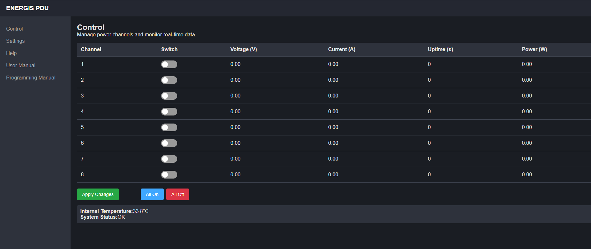
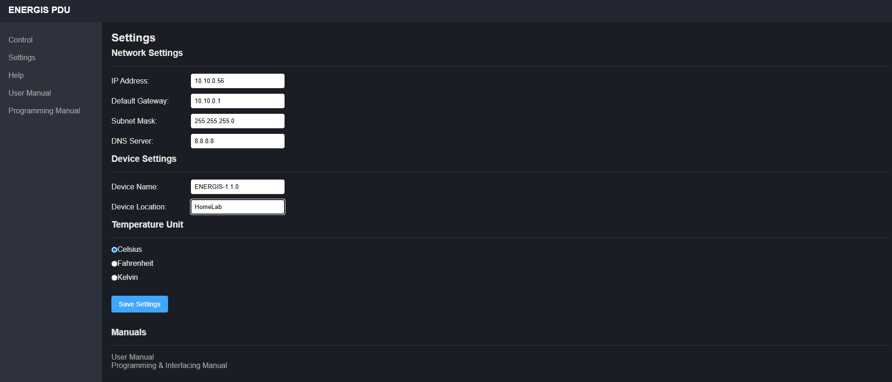

# ENERGIS Managed PDU – User Manual

## Overview

The ENERGIS managed PDU is a rack‑mount power distribution unit that allows you to switch eight AC outlets individually and monitor voltage, current, power and uptime for each channel. The unit is built around a RP2040 microcontroller running FreeRTOS and communicates over Ethernet and serial. All relays are electromechanical and each channel is designed to handle16A. HLW8032 power‑metering chips measure the AC lines, individually per channel. 

The PDU can be controlled locally via the front panel, remotely via a built‑in HTTP server and SNMP agent, or through a USB serial console. This manual explains how to connect the unit, configure it and use these interfaces to integrate the PDU into any automation system.

## Installation and Setup

### Electrical and Network Connections

1. **Mounting and power** – Install the PDU into a 10‑inch equipment rack.  Connect the supplied AC power cord to the mains and attach your load devices to the eight IEC outlets. Each relay is rated 16A. The PDU inlet is 16A max, so the sum of all channels must not exceed 16A

2. **Networking** – Plug an Ethernet cable into the RJ‑45 jack. By default the PDU is programmed to use static IP Address, which can be found on the bottom of the device. The network settings can be read and changed via the web interface or the serial console (see below).

3. **USB/serial** – The PDU exposes its console over USB‑CDC on the USB‑C port. The serial interface operates at 115 200 baud, 8‑N‑1. Connect the USB‑C port to a host computer and open a terminal program (PuTTY, screen, minicom, etc.); the PDU enumerates as a CDC device without drivers. 
**Note:** The internal HLW8032 power meter uses UART0 at 4 800 baud and it is NOT exposed externally.

### First Boot

On first boot the PDU performs a self‑test, initializes the display and relays and loads configuration from its internal EEPROM. The internal power monitor performs a self-check, this makes the Power LED turns on. The eight outlet LEDs will play a pattern and the network LED will come on once a link is detected.

## Local Operation

### Front Panel Buttons and LEDs

When the device is powered, any interaction with any buttons will start a 10s selection window, in which the currently selected channel is shown by a blinking orange light. After 10 seconds of inactivity the selection times out and no channel is highlighted.

Each channel has two indicators: a green LED showing whether the channel is on or off. An orange LED showing which channel is currently selected. Within the selection window, the user is able to turn on and off any channel.

#### Status LEDs:

* **PWR** LED indicates that the PDU is energised, and the internal power is within the expected range.
* **ETH** LED lights when a link is established on the Ethernet port. 
* **ERR** LED lights if an internal error is detected; clear it with a long press of the **Set** button.

#### Button functions:

* **Left** / **Right**: Within the selection window, use these buttons to move the selection highlight across the eight channel status LEDs.  The highlight wraps around after channel 8.
* **Set**: 
   - Outside the selection window, a short press on any button only opens the 10 s window (no step, no toggle).
   - Inside the selection window, a short‑press toggles the currently selected channel on/off. 
   - Anytime, a long press (>1 s) clears the fault LED. 
* **PWR**: The Power button is reserved and has no effect.


## Command‑Line Interface - Serial

A comprehensive serial console is available over the USB‑C port (USB‑CDC). After connecting with a terminal program at 115200 baud basic system health information can be seen, emitted every 60 seconds. Type `help` to list commands.  

### Command list

| Command                           | Description                                                     | Example                 |
|-----------------------------------|-----------------------------------------------------------------|-------------------------|
|GENERAL COMMANDS |
| `HELP`                            | Show available commands and syntax                              | |
| `SYSINFO`                         | Show system information                                         | |
| `GET_TEMP`                        | Show MCU temperature                                            | |
|OUTPUT CONTROL AND MEASUREMENT|
| `SET_CH <ch> <STATE>`             | Set channel <ch> (1–8) to <state> (0|1|ON|OFF|ALL).             | `SET_CH 1 1`            |
| `GET_CH <ch>`                     | Read current state of channel `n`. (1-8|ALL)                    | `GET_CH 3`              |
| `READ_HLW8032`                    | Read power data for all channels                                | |
| `READ_HLW8032 <ch>`               | Read power data for <ch> (1-8)                                  | `READ_HLW8032 2`        |
| `CALIBRATE <ch> <V> <I>`          | Start single <ch> (1-8) calibration on given voltage and current| `CALIBRATE 2 0 0 (Off state - zero calibration)` |
| `AUTO_CAL_ZERO`                   | Zero-calibrate all channels.                                    | |
| `AUTO_CAL_V <voltage>`            | Voltage-calibrate all channels.                                 | `AUTO_CAL_V 230`        |
| `SHOW_CALIB <ch>`                 | Show calibration data (1-8|ALL)                                 | `SHOW_CALIB 5`          |
|NETWORK SETTINGS|
| `NETINFO`                         | Display the current IP, subnet mask, gateway and DNS addresses. | |
| `SET_IP <ip>`                     | Set a static IP address.  Requires reboot.                      | `SET_IP 10.10.0.67`     |
| `SET_SN <mask>`                   | Set the subnet mask.                                            | `SET_SN 255.255.255.0`  |
| `SET_GW <gw>`                     | Set the default gateway.                                        | `SET_GW 192.168.1.1`    |
| `SET_DNS <dns>`                   | Set the DNS server.                                             | `SET_DNS 8.8.8.8`       |
| `CONFIG_NETWORK <ip$sn$gw$dns>`   | Configure all network settings.                                 | `CONFIG_NETWORK 254.176.0.2$255.255.255.0$254.176.0.1$1.1.1.1` |
| `REBOOT`                          | Reboot the PDU. Changes to network settings take effect after reboot. | |

Responses are printed as plain text; network changes are saved to EEPROM and take effect after a reboot.

## UART0 and HLW8032

The HLW8032 power‑meter IC communicates with the RP2040 over UART0 at 4 800 baud. This interface is internal; it is not exposed to the user and cannot be accessed via the external UART. Power measurements are provided through the HTTP, SNMP and CDC interfaces.

## HTTP API

The embedded HTTP server listens on port 80 and exposes JSON endpoints under `/api/...` plus a few HTML pages (`*.html`) for browsers.

> Notes
> • All API responses use `HTTP/1.1` and include `Connection: close`.
> • **Status codes:**
> `GET /api/status` → `200 OK` (JSON body)
> `GET /api/settings` → `200 OK` (JSON body)
> `POST /api/control` → `200 OK` (text body `OK`)
> `POST /api/settings` → `204 No Content` (device reboots) .

### GET `/api/status`

Returns a JSON object with:

* `channels`: array of 8 per-channel objects `{ voltage, current, uptime, power, state }`
* `internalTemperature`: die temperature
* `temperatureUnit`: `"°C"` (or user-selected unit)
* `systemStatus`: overall status string

**Example:**

```powershell
curl.exe -s http://<pdu-ip>/api/status
```

Response:

```json
{
  "channels": [
    { "voltage": 0, "current": 0, "uptime": 0, "power": 0, "state": false },
    { "voltage": 0, "current": 0, "uptime": 0, "power": 0, "state": false },
    { "voltage": 0, "current": 0, "uptime": 0, "power": 0, "state": false },
    { "voltage": 0, "current": 0, "uptime": 0, "power": 0, "state": false },
    { "voltage": 0, "current": 0, "uptime": 0, "power": 0, "state": false },
    { "voltage": 0, "current": 0, "uptime": 0, "power": 0, "state": false },
    { "voltage": 0, "current": 0, "uptime": 0, "power": 0, "state": false },
    { "voltage": 0, "current": 0, "uptime": 0, "power": 0, "state": false }
  ],
  "internalTemperature": 26.97,
  "temperatureUnit": "°C",
  "systemStatus": "OK"
}
```

### POST /api/control

Controls the relays via form-encoded data.  Each field name is `channelN` where *N* is 1–8:

* set `on` to turn a relay ON,
* set `off` to turn it OFF;
* if a channel field is omitted, that channel is forced OFF.

```sh
# Turn channel 1 and 3 ON (others OFF)
curl.exe -s -o $null -w "%{http_code}`n" -X POST "http://<pdu-ip>/api/control" --data "channel1=on&channel3=on"

# Turn channel 3 OFF (and leave others OFF by omission)
curl.exe -s -o $null -w "%{http_code}`n" -X POST "http://<pdu-ip>/api/control" --data "channel3="
```

All unspecified channels are forced off.  **A successful request returns `200 OK` (body `OK`).**  **Missing or malformed body returns `400 Bad Request`.**

### GET /api/settings

Returns the stored network configuration and user preferences in JSON:

```sh
curl.exe -s "http://<pdu-ip>/api/settings"
```

Example response:

```json
{
    "ip":"192.168.0.12",
    "gateway":"192.168.0.1",
    "subnet":"255.255.255.0",
    "dns":"8.8.8.8",
    "device_name":"ENERGIS-1.1.0",
    "location":"Location",
    "temp_unit":"celsius",
    "temperature":33.35,
    "timezone":"",
    "time":"00:00:00",
    "autologout":5}
```

### POST /api/settings

Updates network parameters and user preferences.  Fields include `ip`, `mask`, `gateway`, `dns`, `deviceName`, `location`, `tempUnit` and (`C`, `F` or `K`). Changes are saved to EEPROM; the device **responds `204 No Content` and then reboots**.

Example:

```sh
curl.exe -s -o $null -w "%{http_code}`n" -X POST "http://<pdu-ip>/api/settings" ^
  --data "ip=192.168.0.12&gateway=192.168.0.1&subnet=255.255.255.0&dns=8.8.8.8&device_name=ENERGIS&location=Rack1&temp_unit=celsius"
```

## HTML pages

### GET /control.html

Control UI, uses /api/status and /api/control under the hood.



### GET /settings.html

Serves an HTML settings page for use in a browser.  It displays current network values and allows updating them via a form. Posts to /api/settings.



### GET /help.html, GET /user_manual.html, GET /programming_manual.html

Documentation pages


## SNMP interface

This firmware exposes a compact **SNMPv1** agent (community `public`). A static table binds each OID to a getter (and sometimes a setter). The table itself carries the SNMP type and the maximum response length; the getters in the submodules return the bytes to match that declaration. Identity (MIB-II `system`) lives alongside a private enterprise subtree at **1.3.6.1.4.1.19865** for outlets, power telemetry, rails/temperature, and a read-only mirror of network settings. No request performs heavy work: outlet writes toggle state immediately; reads return cached or computed values with fixed, short encodings.

Two encoding patterns matter:

* **Outlet states** are **INTEGER (4 bytes)**: GET returns a 32-bit `0` or `1`, and SET treats any non-zero as “on”. Group controls are also typed as INTEGER. 
* **Measurements** (power, rails, temperature, etc.) and **network** values are **OCTET STRINGs** containing **ASCII** like `"230.12"` or `"192.168.0.50"`. Parse as text. Buffers are small (≤16 bytes).

### Submodules

#### System & table layer

Owns the SNMP community (`public`), publishes the MIB-II `system` group (sysDescr, sysObjectID=enterprise `1.3.6.1.4.1.19865`, sysUpTime, sysContact, sysSN, sysLocation, sysServices), and wires all private OIDs to domain getters/setters. It also defines an initial warmStart trap helper under the same enterprise. The table is “dumb”: it declares type/length and calls into the right function; logic lives in the domain modules.

**Key OIDs (system):**

* `1.3.6.1.2.1.1.1.0` sysDescr (string)
* `1.3.6.1.2.1.1.2.0` sysObjectID = `1.3.6.1.4.1.19865`
* `1.3.6.1.2.1.1.3.0` sysUpTime (TimeTicks)
* `1.3.6.1.2.1.1.4.0` sysContact (string)
* `1.3.6.1.2.1.1.5.0` sysSN (string)
* `1.3.6.1.2.1.1.6.0` sysLocation (string)
* `1.3.6.1.2.1.1.7.0` sysServices (INTEGER) 


#### Outlet control (read/write)

Eight independent channels and two group triggers. Per-channel GET returns a 4-byte INTEGER (0/1). Per-channel SET: `0` → off, any non-zero → on. Group triggers **apply the action when you write any non-zero**, and their GET encodes whether **all** channels currently match that state. Internally, OID channels are 1..8; drivers use 0..7.

**Per-channel state (INTEGER):**

* **Format:** `.1.3.6.1.4.1.19865.2.<ch>.0` where `<ch>=1..8`

  * GET → int32 `0` or `1`
  * SET → `i 0` or `i 1` (non-zero treated as `1`)
    Example (CH3):

  ```sh
  snmpget -v1 -c public -Oqv <pdu-ip> 1.3.6.1.4.1.19865.2.3.0
  ```


**Group controls (INTEGER):**

* **All OFF (trigger):** `.1.3.6.1.4.1.19865.2.9.0`
  GET → `'1'` only if every channel is off; SET non-zero → force all off. 
* **All ON (trigger):** `.1.3.6.1.4.1.19865.2.10.0`
  GET → `'1'` only if every channel is on; SET non-zero → force all on. 

Implementation detail: per-channel GET always returns **exactly 4 bytes** to match the table’s INTEGER declaration. Group GET encodes `'0'/'1'` via a one-byte helper but the table still declares INTEGER. Managers will still treat these as INTEGER because the table declares INTEGER, the single-byte helper is an internal optimization.


#### Power and energy telemetry (per channel, read-only)

Six metrics per channel, all as **ASCII strings** in OCTET STRINGs, pulled from the **cached** metering snapshot (no blocking I/O on the SNMP path). If the cache isn’t valid yet, you’ll see zeros by design. 

**Per-channel telemetry:**

* **Voltage [V]:** `.1.3.6.1.4.1.19865.5.<ch>.1.0` → `"%.2f"`
* **Current [A]:** `.1.3.6.1.4.1.19865.5.<ch>.2.0` → `"%.3f"`
* **Power [W]:** `.1.3.6.1.4.1.19865.5.<ch>.3.0` → `"%.1f"`
* **Power factor:** `.1.3.6.1.4.1.19865.5.<ch>.4.0` → `"%.3f"`
* **Energy [kWh]:** `.1.3.6.1.4.1.19865.5.<ch>.5.0` → `"%.3f"`
* **Uptime since ON [s]:** `.1.3.6.1.4.1.19865.5.<ch>.6.0` → `"12345"` (decimal ASCII)

Quick sense of outputs for channel 1:

```sh
snmpget -v1 -c public -Oqv <pdu-ip> 1.3.6.1.4.1.19865.5.1.1.0   # "230.12"
snmpget -v1 -c public -Oqv <pdu-ip> 1.3.6.1.4.1.19865.5.1.2.0   # "0.534"
snmpget -v1 -c public -Oqv <pdu-ip> 1.3.6.1.4.1.19865.5.1.3.0   # "85.3"
```


Formatting is centralized (`ftoa`, `u32toa`) and capped at 16 bytes per response. Precision is uniform across channels and metrics. 


#### Rails and temperature (read-only)

On-die temperature and board rails, formatted as short ASCII. The module samples Pico ADC for the die sensor (with a tiny low-pass/settle step) and uses HAL helpers for external rails. Everything fits in 16 bytes. 

**OIDs:**

* **Die sensor (voltage):** `.1.3.6.1.4.1.19865.3.1.0` → `"%.5f"`
* **Die temperature [°C]:** `.1.3.6.1.4.1.19865.3.2.0` → `"%.3f"`
* **V_SUPPLY [V]:** `.1.3.6.1.4.1.19865.3.3.0` → `"%.3f"`
* **V_USB [V]:** `.1.3.6.1.4.1.19865.3.4.0` → `"%.3f"`
* **V_SUPPLY divider tap:** `.1.3.6.1.4.1.19865.3.5.0`
* **V_USB divider tap:** `.1.3.6.1.4.1.19865.3.6.0`
* **Core VREG [V]:** `.1.3.6.1.4.1.19865.3.7.0` → `"%.2f"`
* **Core VREG status:** `.1.3.6.1.4.1.19865.3.8.0` → `"OK" | "Overload" | "Hi-Z" | "Unknown"`
* **Bandgap ref:** `.1.3.6.1.4.1.19865.3.9.0`
* **USB PHY rail:** `.1.3.6.1.4.1.19865.3.10.0`
* **IO rail:** `.1.3.6.1.4.1.19865.3.11.0`


#### Network configuration mirror (read-only)

Reflects the **persisted** network config (EEPROM) as dotted-decimal **strings**. On read failure it **falls back to compiled defaults** so walks are predictable. These are **not writable** via SNMP in this build. 

**OIDs:**

* **IP address:** `.1.3.6.1.4.1.19865.4.1.0` → `"A.B.C.D"`
* **Subnet mask:** `.1.3.6.1.4.1.19865.4.2.0` → `"A.B.C.D"`
* **Gateway:** `.1.3.6.1.4.1.19865.4.3.0` → `"A.B.C.D"`
* **DNS server:** `.1.3.6.1.4.1.19865.4.4.0` → `"A.B.C.D"` 


### Failure modes and things worth knowing

* **Type discipline:** outlet nodes are 4-byte INTEGERs; telemetry and network are ASCII strings. If your NMS expects numbers everywhere, it will complain on the string nodes. Parse them.
* **“All on/off” asymmetry:** those two report aggregate state and execute batch writes on any non-zero input; `0` is ignored. Verify final state with per-channel GETs if you need certainty. 
* **Small buffers, fixed precision:** string responses are capped at 16 bytes, with formats like `"%.2f"`, `"%.3f"`. If you widen precision in firmware, update the table lengths or you’ll truncate.
* **Cached telemetry:** power data is a snapshot from the MeterTask cache. Immediately after enabling a channel, it may read `"0.000"` until the next update. This path never blocks waiting for the meter. 
* **Network fallback:** if EEPROM is blank or inaccessible, the network mirror returns compiled defaults. If your reads show defaults, the storage flow didn’t load. 
* **Table is authoritative:** per-channel outlet GET always returns exactly 4 bytes to match the table’s INTEGER definition, even if the internal code path could compute a one-byte value. Keep your client side tolerant. 


### Summary

One static table, four domains. Outlets are writable **INTEGER** scalars at `.1.3.6.1.4.1.19865.2.<ch>.0`, with two **INTEGER** triggers for “all off/on.” Power telemetry is six **ASCII string** metrics per channel at `.1.3.6.1.4.1.19865.5.<ch>.<metric>.0`, pulled from a non-blocking cache. Rails/temperature live under `.1.3.6.1.4.1.19865.3.*.0` as short strings. Network settings are read-only, dotted-decimal strings under `.1.3.6.1.4.1.19865.4.*.0`, with EEPROM-to-default fallback. Respect types and 16-byte limits, assume cached updates for measurements, and rely on per-channel reads to verify group actions.


## Support

For firmware updates and source code, visit the project’s GitHub repository. For technical support or to report bugs, contact the maintainer listed in the SNMP `sysContact` field (`dvidmakesthings@gmail.com`).